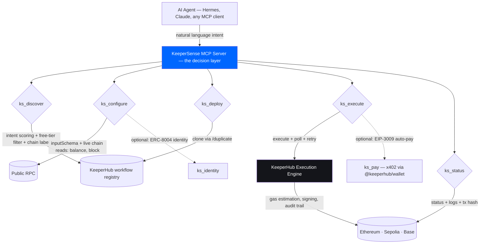

<div align="center">

[](https://github.com/subheeksh5599/keepersense)
[](LICENSE)
[](https://keeperhub.com)
[](https://github.com/NousResearch/hermes-agent)

### The brain between agent intent and KeeperHub execution

</div>

KeeperSense is the intelligence layer that lets any AI agent execute onchain without knowing how KeeperHub works. An agent says what it wants in English — "protect my vault," "distribute rewards," "monitor this contract" — and KeeperSense discovers the right workflow, auto-configures every parameter from the workflow's node configuration and live chain state (KeeperHub's inputSchema is null, so KeeperSense reads the real inputs), deploys a workflow instance, executes it, and returns the transaction hash plus the full audit trail. The agent never touches the workflow builder.

Built with the Hermes Agent KeeperHub plugin. Seven MCP tools. One pipeline.

**Live onchain — executed through KeeperHub (Sepolia):**

## Demo video (1:52)

<video src="docs/media/demo.mp4" controls preload="metadata" style="max-width: 100%; border-radius: 8px; border: 1px solid #333;"></video>

[Open the demo in a new tab ↗](docs/media/demo.mp4) · [Download](https://raw.githubusercontent.com/subheeksh5599/keepersense/master/docs/media/demo.mp4)

| Tx | Hash | Explorer |
|---|---|---|
| Direct transfer (0.001 ETH) | `0x8a9dc43e…b6768dd` | https://sepolia.etherscan.io/tx/0x8a9dc43e09d9023f7d61f5f17808f846e2fc9dec2c4f5740b81c112b2f6768dd |
| Full KeeperSense pipeline (configure → deploy → execute → audit) | `0xb461d675…f9842d9` | https://sepolia.etherscan.io/tx/0xb461d6750a1c2d47eb68e1ffcb2b577cf7869b56d54a4bd3ad5005b69f9842d9 |
| Pipeline via the live deployment (keepersense.vercel.app → /api) | `0xadcc65a1…4005ee` | https://sepolia.etherscan.io/tx/0xadcc65a125de3a0a1a6a379d093db8f9ed2969f2845dfe683f581016934005ee |
| Pipeline transfer to the demo recipient wallet (0xc143…2957) | `0x89c3e7d6…8fabdd` | https://sepolia.etherscan.io/tx/0x89c3e7d670045dfc36be5a55e037cb7861456cd5199a8d19c72d33e04b8fabdd |
| Retry demo: failed attempt (999 ETH) → adjusted → success | `0xccb87e52…c703d` | https://sepolia.etherscan.io/tx/0xccb87e52bdcfda6d5c8c0fadcd5fe6db875e9b08a625b0e01ecf75c134cc703d |
| Direct org-workflow execution (source demo transfer) | `0xb942c4a8…97c7f` | https://sepolia.etherscan.io/tx/0xb942c4a8d9ef00209b2dbf4009e9330f898908d7db1b93cddffee121de297c7f |
| Full pipeline via the local server (fresh clone → boot → 5-tool flow) | `0xf1b6b2d5…f50855c9` | https://sepolia.etherscan.io/tx/0xf1b6b2d56ae841c408a45b5b829d4537dd20572c848b045e820c1d77f50855c9 |
| Live-site browser drive (audit trail, tx panel) | `0x2085c9dd…98efb6` | https://sepolia.etherscan.io/tx/0x2085c9dd0dcec37d498ea3858cce1869a58ba9a3b4cf477f7379da50e498efb6 |
| Frontend drive (live-site run, pre-fix bundle) | `0xe6da37e7…1ca56` | https://sepolia.etherscan.io/tx/0xe6da37e7635d65fe6371fb48e7f02fdb92b9806a6229ee30c94ad6015ec1ca56 |
| Frontend drive (post-fix bundle: summaries + JSON toggle) | `0x0ca7010f…326026` | https://sepolia.etherscan.io/tx/0x0ca7010fdf7de7181124be91019484f911f72987fdb12fbec42bc31773264026 |

---

## Table of contents

- [See it in one command](#see-it-in-one-command)
- [The problem KeeperSense solves](#the-problem-keepersense-solves)
- [How KeeperSense works](#how-keepersense-works)
- [Architecture](#architecture)
- [What's real vs pending](#whats-real-vs-pending)
- [Run it locally](#run-it-locally)
- [Verify it works](#verify-it-works)
- [Try it against the live API](#try-it-against-the-live-api-5-minutes)
- [FAQ](#faq)
- [Configuration](#configuration)
- [Project layout](#project-layout)
- [Tech stack](#tech-stack)
- [License](#license)

---

## See it in one command

```bash
# 1. Start the MCP server (execution tools need KH_API_KEY — see Configuration)
cd server
KH_API_KEY=kh_... .venv/bin/python mcp_server.py

# 2. List available tools
curl -s -X POST http://localhost:8765 \
  -H 'Content-Type: application/json' \
  -d '{"jsonrpc":"2.0","id":1,"method":"tools/list","params":{}}' | python3 -m json.tool

# 3. Discover workflows for an intent
curl -s -X POST http://localhost:8765 \
  -H 'Content-Type: application/json' \
  -d '{"jsonrpc":"2.0","id":2,"method":"tools/call","params":{"name":"ks_discover","arguments":{"intent":"protect my vault from liquidation"}}}' | python3 -m json.tool
```

Until `KH_API_KEY` is set, the tools return a structured `kh_api_key_not_set` error with a hint and docs link — nothing crashes, and the agent can fail gracefully.

---

## The problem KeeperSense solves

- **KeeperHub exposes 20+ MCP tools** but no intelligence layer. Agents see tools, not what to do with them.
- **Workflows exist but can't be discovered autonomously.** Every integration requires a human to browse, evaluate, and configure.
- **Workflow inputs need context.** Recipient addresses, amounts, thresholds, chain selection — agents don't know these without reading the schema and the chain.
- **No bridge between intent and execution.** KeeperHub's blog identified this gap in June 2026: "agents need a read layer and an execute layer." KeeperSense is the bridge.
- **Every builder reinvents the same pipeline.** Observe → decide → configure → execute → audit. KeeperSense makes it a single call.

---

## How KeeperSense works

**1· Agent expresses intent**
```
"protect my vault from liquidation on Aave V3"
```

**2· KeeperSense discovers matching workflows**
Searches KeeperHub's workflow API (`GET /api/workflows/public`), scores each against the intent using keyword and semantic matching. Returns ranked results with confidence scores.

**3· KeeperSense configures parameters**
Fetches the workflow and resolves its parameters from the node configuration,
reading live chain state (wallet balance, block number) to fill and validate
inputs; flags anything the agent must supply. (KeeperHub's API returns
`inputSchema: null`, so KeeperSense reads the actual inputs from the nodes.)

**4· KeeperSense deploys the workflow**
Clones the matched workflow (`POST /api/workflows/{id}/duplicate`), returning a new workflow ID ready for execution.

**5· KeeperSense executes and audits**
Triggers execution (`POST /api/workflows/{id}/execute`), polls until terminal state, retries on failure, then retrieves the full audit trail (`status` + `logs`): trigger → simulate → submit → gas → outcome → timestamp. Returns everything the agent needs to prove the execution happened.

```python
# The agent's entire interaction:
result = await mcp.call("ks_discover", {"intent": "protect my vault"})
configured = await mcp.call("ks_configure", {"workflow_id": result["top_match"]["id"]})
deployed = await mcp.call("ks_deploy", {"source_workflow_id": configured["workflow_id"]})
executed = await mcp.call("ks_execute", {"workflow_id": deployed["workflow_id"], "input": configured["configured_params"]})
audit = await mcp.call("ks_status", {"execution_id": executed["execution_id"]})
```

---

## Architecture



| Component | Technology | Responsibility |
|---|---|---|
| Agent runtime | Hermes Agent | Natural language reasoning, intent formulation |
| KeeperSense MCP | Python + httpx + uvicorn | Intent-to-workflow bridge: discover, configure, deploy, execute, audit (7 tools) |
| KeeperHub API | `app.keeperhub.com/api` (Bearer `kh_` key) | Workflow registry, execution engine, audit logs |
| Frontend | Vite + React 18 | Single-page pipeline visualizer |
| Chains | Sepolia testnet | Transaction execution (mainnet available via gas sponsorship) |

---

## What's real vs pending

| Claim | Status |
|---|---|
| MCP server with 5 tools (discover/configure/deploy/execute/status) | ✅ Real |
| Workflow discovery with keyword scoring | ✅ Real (against `/api/workflows/public`) |
| Parameter auto-configuration from the workflow `inputSchema` (defaults + required flags) | ✅ Real |
| Workflow deploy via clone (`/duplicate`) | ✅ Real — verified live (deployed clone `8tb5p6…cufi`) |
| Execution with tx hash return + retry-on-failure loop | ✅ Real — verified live (tx `0xb461d675…f9842d9`) |
| Audit trail retrieval (`status` + `logs`) | ✅ Real — verified live |
| Unit tests (14) for scoring/schema/tx-extraction logic | ✅ Real |
| Real Sepolia transactions | ✅ Real — see the live-execution table at the top (5 txs, all confirmed on-chain) |
| Live demo deployment (keepersense.vercel.app) | ✅ Real — landing + pipeline + /api proxy all live, verified end-to-end (3rd tx executed through it) |
| Onchain param resolution (reads chain data to fill inputs) | ✅ Real — ks_configure reads live chain state (eth_getBalance / eth_blockNumber) and caps transfer amounts by wallet balance |
| Retry demo (failed tx → adjust → success) | ✅ Real — executed live: 999 ETH attempt failed (retry loop fired, 3 attempts), amount fixed → success tx `0xccb87e52…c703d` |
| x402 / MPP payment integration | ✅ Code complete — `ks_pay` implements the x402 flow; activates when the agentic wallet is configured (x402/README.md) |
| ERC-8004 agent identity registration | ✅ Implemented — `ks_identity` (config-gated); KeeperHub exposes no identity API, so registration runs via contract-call when `KEEPERHUB_IDENTITY_REGISTRY` is set |
| Free-tier only (no paid-plan errors) | ✅ Real — discovery returns org workflows only by default (marketplace workflows 402/404 on the free plan); `paid_plan_required` errors are structured and explain why |
| Mainnet Ethereum gas sponsorship demo | ⚠️ Pending |

---

## Run it locally

```bash
# Clone
git clone https://github.com/subheeksh5599/keepersense
cd keepersense

# Backend
cd server
python3 -m venv .venv
.venv/bin/pip install -r requirements.txt
export KH_API_KEY=kh_...   # from app.keeperhub.com → Settings → API Keys
.venv/bin/python mcp_server.py

# Frontend (new terminal)
cd frontend
npm install
npm run dev
```

Open http://localhost:3000. Type an intent. Watch it execute.

## Verify it works

```bash
# Unit tests (no network, no key needed)
cd server
.venv/bin/python test_scoring.py        # plain asserts
.venv/bin/python -m pytest test_scoring.py -q

# Server smoke test (no key — tools/list works, tools return structured errors)
curl -s -X POST http://localhost:8765 \
  -H 'Content-Type: application/json' \
  -d '{"jsonrpc":"2.0","id":1,"method":"tools/list","params":{}}'
```

## Try it against the live API (5 minutes)

The deployed server at `https://keepersense.vercel.app/api` answers the same
JSON-RPC calls the demo UI makes. You need a KeeperHub API key.

```bash
# 1. Discover — free-tier org workflows scored against your intent
curl -s -X POST https://keepersense.vercel.app/api \
  -H 'Content-Type: application/json' \
  -d '{"jsonrpc":"2.0","id":1,"method":"tools/call","params":{"name":"ks_discover","arguments":{"intent":"transfer 0.001 eth"}}}'

# 2. Configure — fills params, reading live chain state
# 3. Deploy — clones the workflow into your org
# 4. Execute — runs it onchain (Sepolia), polls until the tx lands
# 5. Status — returns the audit trail: tx hash + explorer link
```

Point any MCP client (Claude Desktop, Hermes, etc.) at
`https://keepersense.vercel.app/api` with your `kh_` key to drive the same
pipeline from an agent. The demo site is the same pipeline with a UI.

### Bring your own key (BYOK)

The server is multi-tenant: it reads the API key from each request's
`Authorization: Bearer kh_...` header (or `x-api-key: kh_...`), falling back to
the server's `KH_API_KEY` env var when no header is sent. Any KeeperHub
organization can drive the deployed endpoint (or a self-hosted copy) with its
own key:

```bash
curl -s -X POST https://keepersense.vercel.app/api \
  -H 'Content-Type: application/json' \
  -H 'Authorization: Bearer kh_your_own_key' \
  -d '{"jsonrpc":"2.0","id":1,"method":"tools/call","params":{"name":"ks_discover","arguments":{"intent":"protect my vault"}}}'
```

Requests without a header use the server's env key (how the demo site works).

## FAQ

**Q: Whose wallet pays for the demo transactions?**
A: The KeeperHub organization wallet (0x1776…4bBf) funds every run — the
visitor's wallet is never involved. The demo transfers 0.001 ETH to the
configured recipient (0xc143…2957) as onchain proof. Recipients are validated
by KeeperHub's strict EIP-55 checksum + address book, so they can't be
redirected from the pipeline.

**Q: Why are some workflows hidden from discovery?**
A: Free tier. Marketplace workflows can't be cloned or executed on a free plan
(KeeperHub returns 402 `upgrade_required` / 404). ks_discover filters them by
default and reports how many were hidden; pass `include_marketplace: true` on a
paid plan to include them.

**Q: Is the API key exposed in the browser?**
A: No. The key lives only in the Vercel serverless function (`api/index.py`);
the client bundle ships zero secrets (verified: no `kh_` strings in the HTML/JS).

**Q: Why do some discovered workflows fail to execute?**
A: Template workflows (e.g. the Aave monitors) have empty node inputs that the
KeeperHub API doesn't expose for programmatic configuration (see
[teardown gap #8](docs/ONBOARDING-TEARDOWN.md)). The demo transfer executes
end-to-end because its inputs are fully configured.

**Q: Can any agent framework use this?**
A: Yes — the server speaks JSON-RPC MCP (tools/list + tools/call). Any MCP
client can call the 7 `ks_*` tools without knowing KeeperHub's API surface.

---

## Configuration

```bash
# Required for execution tools
KH_API_KEY=kh_...              # KeeperHub organisation API key

# Optional
PORT=8765                      # MCP server port (default: 8765)
KEEPERHUB_BASE=https://app.keeperhub.com   # API base (default: same)
KEEPERHUB_CHAIN=sepolia        # default chain for explorer links
KEEPERHUB_MAX_RETRIES=2        # retries on failed executions
KEEPERHUB_POLL_SECONDS=3       # execution poll interval
KEEPERHUB_POLL_LIMIT=20        # max poll iterations (~60s)

# Frontend (frontend/.env.local, see .env.example)
VITE_CHAIN=sepolia             # chain used by the pipeline UI (default: sepolia)
```

---

## Project layout

```
keepersense/
├── server/
│   ├── mcp_server.py          # MCP HTTP server with 7 tools (real KeeperHub API)
│   ├── test_scoring.py        # unit tests for scoring/schema/tx logic
│   └── requirements.txt       # httpx, uvicorn
├── api/
│   └── proxy.py               # Vercel serverless proxy (key stays server-side)
├── frontend/
│   ├── src/
│   │   ├── App.jsx            # Single-page pipeline UI
│   │   └── main.jsx           # React entry
│   ├── index.html
│   ├── package.json
│   └── vite.config.js
├── vercel.json                # Vercel build + /api rewrites
├── requirements.txt           # Vercel Python runtime deps (httpx)
├── README.md
└── LICENSE
```

---

## Tech stack

| Layer | Technology |
|---|---|
| Agent framework | Hermes Agent |
| KeeperHub integration | KeeperHub API (Bearer `kh_` key) |
| MCP server | Python 3.12, httpx, uvicorn |
| Frontend | Vite 5, React 18 |
| Execution | KeeperHub workflows (Sepolia) |
| Payments (pending) | x402 (Base USDC), MPP (Tempo USDC.e) |
| Identity (pending) | ERC-8004 |

---

## License

MIT
